<div align="center">

# Swellread

### Read the water before you paddle out.

**One explainable, sealed verdict per surf break — from real swell, wind and verified tide predictions.**

[](https://swellread.vercel.app)
[](https://swellread.vercel.app/method)
[](https://nextjs.org)
[](https://www.typescriptlang.org)
[](https://threejs.org)
[](https://open-meteo.com)
[](https://tidesandcurrents.noaa.gov)
[](https://swellread.vercel.app/agent)
[](https://swellread.vercel.app/settings#model)
[](#-quickstart)
[](LICENSE)

[Live app](https://swellread.vercel.app) · [GitHub](https://github.com/aniruddhaadak80/swellread) · [API](https://swellread.vercel.app/api/health) · [Agent](https://swellread.vercel.app/agent) · [Issues](https://github.com/aniruddhaadak80/swellread/issues)

</div>

---

I built this for someone who drives two hours to a reef pass and is disappointed by a forecast they
cannot read. Swellread answers one question honestly: **given real swell, wind and verified tide, is it
worth driving to this break today, and at which hours?** Every number that moves the verdict is shown,
and every plan you keep is sealed so you can prove later what the water was.

<p align="center">
  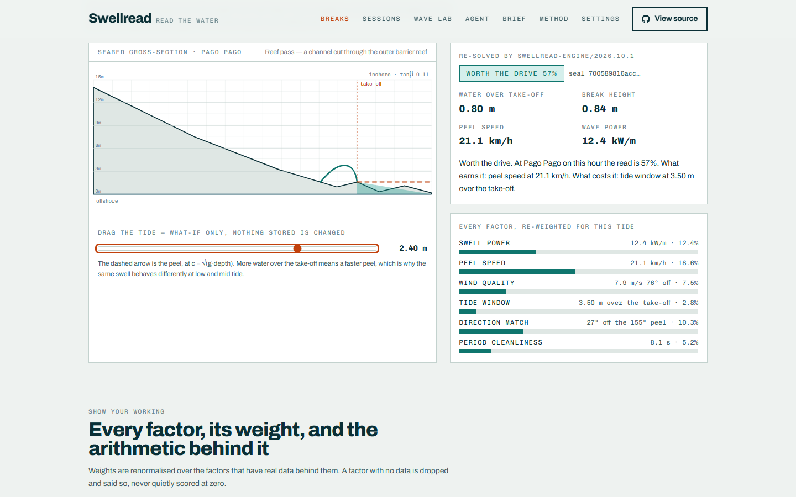
</p>

The control above is the whole product in one gesture. **Peel speed is shallow-water celerity,
c = √(g·depth)** — so dragging the tide re-cuts the seabed, the peeling section re-solves, and the shared
engine re-runs on the server and returns a new seal. Same 1.66 m swell: 12 km/h on a low tide, 21 km/h
on a high one. Unridable versus the best thing on the coast.

<p align="center">
  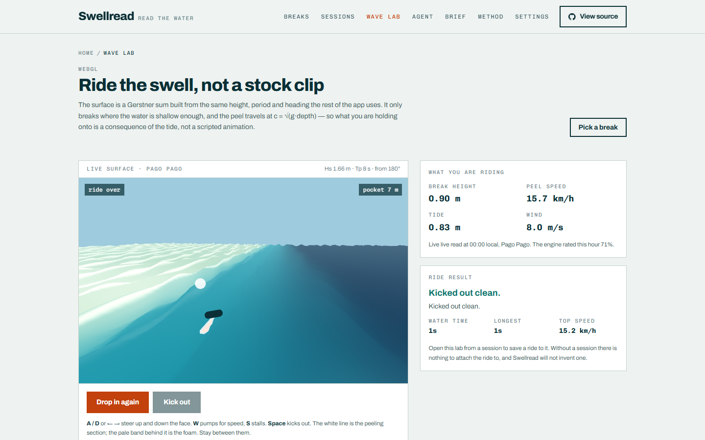
</p>

---

## ✨ Features

| What you get | Why it matters |
| --- | --- |
| **A verdict for every hour, not one number for the day** | `GET /api/conditions` returns 24 scored hours with the tide curve drawn over them. Pick the hour; it lives in the URL so you can send someone the exact slice. |
| **Six weighted factors, each showing its arithmetic** | Swell power, peel speed, wind quality, tide window, direction match, period cleanliness. A factor with no real data is *dropped and labelled*, never quietly scored at zero. |
| **Hard gates that override the score** | Below 0.35 m of swell the score is zero, because there is nothing to break on. Below a reef's minimum safe depth it is clamped to 0.08, because that is a hazard rather than a score. |
| **A tide drag that really re-runs the engine** | The signature interaction. It POSTs a what-if to `/api/engine`; there is no local copy of the maths anywhere in the client. |
| **A playable WebGL wave** | A Gerstner surface built from the same height, period and heading as the rest of the app, breaking where H/d = 0.78, peeling at the engine's own speed. Steer with A/D, pump with W, kick out with Space. |
| **Sealed plans you can hand to someone else** | Every session freezes its conditions and verdict, and appends a SHA-384 link to a per-entity chain. Export a printable brief, a share route, or the JSON. |
| **An MCP agent that can read *and write*** | Eight typed tools over JSON-RPC 2.0. Four mutate through the exact same service layer as the web UI, and `create_session` is idempotent. |
| **An open-weights model that never leaves your device** | `all-MiniLM-L6-v2` weights are **committed to this repository** and loaded with `allowRemoteModels = false`. Your note about the water is read in your tab, used to find your own similar past sessions, and sent nowhere. |
| **Honest degradation** | Where no NOAA tide station is in range, the tide factor is dropped and the remaining weights are renormalised — and the page says so. Where every upstream is down, a sealed dated sample is shown and labelled `fallback`. |

---

## 🚀 Quickstart

```bash
git clone https://github.com/aniruddhaadak80/swellread
cd swellread
npm ci
npm run dev
```

**That is the whole setup. Zero required environment variables.** With nothing configured, Swellread runs
on an embedded PGlite database at `./.data/pglite`, seeds its break catalogue idempotently on first run,
and talks to the real NOAA and Open-Meteo APIs.

```bash
npm run typecheck   # tsc --noEmit
npm run lint        # eslint
npm test            # vitest — 137 deterministic tests
npm run build       # next build
npm run check       # all three gates in sequence
```

### Production environment variables

| Variable | Required | Purpose |
| --- | --- | --- |
| `DATABASE_URL` | **yes in production** | A hosted Postgres connection string (Neon, Vercel Postgres, Supabase — anything speaking `postgres://`). |
| `NEXT_PUBLIC_SITE_URL` | no | Absolute URL for canonical tags, OpenGraph and the sitemap. Vercel sets this itself. |
| `SWELLREAD_ALLOW_LOCAL_STORE` | no | Deliberately permits the embedded store in production. Set it only for preview deploys; data will not survive a redeploy. |

Without `DATABASE_URL` in production, **Swellread refuses to start** rather than silently accepting writes
that vanish on the next cold start. See `.env.example`.

---

## 🔌 API

Everything the interface can do, over plain HTTP. All responses are JSON; errors are always
`{ "error": { "code", "message" } }`.

### Read a break's live conditions

```bash
curl -s "https://swellread.vercel.app/api/conditions?breakId=pago-pago&hour=8" | head -c 400
```

```jsonc
{
  "status": "live",                       // "live" | "mixed" | "fallback" — never hidden
  "snapshot": {
    "date": "2026-10-03",
    "hours": [ /* 24 normalised hourly rows */ ],
    "sources": [
      { "id": "open-meteo-marine", "status": "live", "stale": false, "url": "https://open-meteo.com/…" },
      { "id": "noaa-coops",        "status": "live", "stale": false, "url": "https://tidesandcurrents.noaa.gov/…" }
    ]
  },
  "points": [ { "localLabel": "08:00", "score": 0.68, "band": "worth-the-drive", "tideM": 0.17 } ]
}
```

### The engine, and the tide what-if

```bash
# the real verdict for one hour
curl -s "https://swellread.vercel.app/api/engine?breakId=pago-pago&hour=8"

# "what if the tide were 2.4 m?" — never writes anything back
curl -s -X POST "https://swellread.vercel.app/api/engine" \
  -H "content-type: application/json" \
  -d '{"breakId":"pago-pago","hour":8,"tideM":2.4}'
```

```jsonc
{
  "whatIf": { "tideM": 2.4 },
  "engine": {
    "version": "swellread-engine/2026.10.1",
    "score": 0.68,
    "band": "worth-the-drive",
    "factors": [
      {
        "key": "peelSpeed", "available": true, "raw": 21.1, "rawLabel": "21.1 km/h",
        "weight": 0.2, "effectiveWeight": 0.2, "contribution": 0.1806,
        "evidence": "c = sqrt(g · depth) = sqrt(9.81 · 4.60 m) = 21.1 km/h over a 4.60 m take-off…"
      }
    ],
    "gates": [],
    "derived": { "breakHeightM": 0.9, "peelSpeedKmh": 21.1, "powerKwM": 14.1, "depthAtBreakM": 4.6 },
    "window": { "bestStart": "…", "goodHours": ["…"] },
    "seal": "700589816acc…"
  }
}
```

### A mutation, then read it back

```bash
BASE=https://swellread.vercel.app

# 1. create (the response carries the first audit seal)
ID=$(curl -s -X POST "$BASE/api/sessions" \
  -H "content-type: application/json" \
  -d '{"breakId":"pago-pago","plannedFor":"2026-10-03T18:00:00.000Z","status":"committed","idempotencyKey":"demo-1"}' \
  | sed -n 's/.*"id":"\([^"]*\)".*/\1/p')
echo "created $ID"

# 2. read back
curl -s "$BASE/api/sessions/$ID" | head -c 300

# 3. update — bumps the version and appends a sealed event
curl -s -X PATCH "$BASE/api/sessions/$ID" \
  -H "content-type: application/json" -d '{"call":"in","confidence":4}'

# 4. log a ride from the WebGL lab
curl -s -X POST "$BASE/api/sessions/$ID/rides" \
  -H "content-type: application/json" \
  -d '{"durationSec":210,"longestRideSec":42,"topSpeedKmh":28.4,"completed":true}'

# 5. replay the integrity chain
curl -s "$BASE/api/integrity/$ID" | head -c 300

# 6. export the brief as a file
curl -s "$BASE/api/brief/$ID?format=json" -o brief.json

# 7. soft delete — keeps a tombstone so the chain still replays
curl -s -X DELETE "$BASE/api/sessions/$ID"
```

### Health

```bash
curl -s https://swellread.vercel.app/api/health
```

```jsonc
{
  "ok": true,
  "store": { "kind": "neon", "productionStore": true, "label": "Hosted Postgres (Neon serverless driver)" },
  "persistence": { "probe": "SELECT 1 succeeded; sessions table holds 12 row(s)" }
}
```

The probe is a real query, not a static object. See [verifying a deployment](#-verifying-a-deployment).

---

## 🧠 Agent interface

Live JSON-RPC 2.0 over HTTP at **`/api/mcp`**. `GET` on that URL returns a discovery document; `POST`
accepts a single message or a batch. A published manifest lives at [`public/mcp.json`](public/mcp.json).

```bash
curl -s https://swellread.vercel.app/api/mcp \
  -H "content-type: application/json" \
  -d '{"jsonrpc":"2.0","id":1,"method":"initialize",
       "params":{"protocolVersion":"2025-06-18","capabilities":{},"clientInfo":{"name":"curl","version":"1"}}}'
```

```json
{
  "jsonrpc": "2.0", "id": 1,
  "result": {
    "protocolVersion": "2025-06-18",
    "serverInfo": { "name": "Swellread", "engineVersion": "swellread-engine/2026.10.1" },
    "capabilities": { "tools": { "listChanged": false } }
  }
}
```

| Tool | Kind | What it does |
| --- | --- | --- |
| `list_breaks` | read | The catalogue, including which tide station (if any) is in range. |
| `get_conditions` | read | Normalised 24-hour slice with full attribution. |
| `analyse_break` | analysis | The sealed verdict, every factor, gates and the day's window. |
| `verify_integrity` | read | Recomputes a session's chain and names the first broken link. |
| `create_session` | **mutating** | Freezes conditions + verdict. Idempotent on `idempotencyKey`. |
| `decide_session` | **mutating** | Records an in/out call and confidence. |
| `log_ride` | **mutating** | Same write path the lab's save button uses. |
| `delete_session` | **mutating** | Soft delete, tombstone retained. |

Configuring an MCP client:

```json
{
  "mcpServers": {
    "swellread": {
      "type": "http",
      "url": "https://swellread.vercel.app/api/mcp"
    }
  }
}
```

Every mutating tool is scoped to the anonymous HTTP-only cookie of the browser it was called from. An
agent cannot read or delete another rider's session, because it has no way to name one. Try it yourself in
the [in-page agent console](https://swellread.vercel.app/agent) — one click per tool, with the exact
request and response shown.

---

## 📁 Project map

### User routes

| Route | What it is for |
| --- | --- |
| `/` | Today's real verdict for the hero break, the tide ribbon, and the three jobs this does. |
| `/breaks` | The 14-break catalogue, filterable by what each one can and cannot tell you. |
| `/breaks/[id]` | **Dynamic.** Live 24-hour slice, the factor table with its arithmetic, and the tide-drag cross-section. `?hour=` selects the hour. |
| `/sessions` | Your workspace. Status filter and paging live in the URL, so a filtered view is a shareable link. |
| `/sessions/[id]` | **Dynamic.** Frozen conditions, decide/annotate/delete, the on-device feel match, rides, and the full audit chain. |
| `/lab` | The WebGL wave lab. Open from a session to attach rides to it. |
| `/agent` | Live MCP JSON-RPC console with one-click calls for all eight tools. |
| `/export` | Build the handover brief, with a real JSON download. `?session=`. |
| `/settings` | Units, the bundled model, ownership, the store, and the security model. |
| `/verify` | Replay any chain from its id. `?id=`. |
| `/method` | Every formula, weight, gate and boundary case, written down. |
| `/share/[id]` | **Dynamic.** The stable handover route. Anyone with the link can read it. |

### API routes

| Route | Methods | Responsibility |
| --- | --- | --- |
| `/api/health` | GET | Real persistence probe against the configured store. |
| `/api/breaks` | GET | The catalogue, no upstream call. |
| `/api/breaks/[id]` | GET | Break + live slice + engine verdict + the day's scores. |
| `/api/conditions` | GET | Normalised conditions with attribution and honest status. |
| `/api/engine` | GET, POST | The verdict for a real hour; POST takes a what-if tide. |
| `/api/sessions` | GET, POST | List and create. Idempotency supported. |
| `/api/sessions/[id]` | GET, PATCH, DELETE | Read, update, soft delete. |
| `/api/sessions/[id]/rides` | POST | Log a ride. |
| `/api/integrity/[id]` | GET | Recompute and verify the chain. |
| `/api/brief/[id]` | GET | The exportable brief. `?format=json` downloads it. |
| `/api/mcp` | GET, POST | MCP discovery document and JSON-RPC endpoint. |

### Library

| Path | Responsibility |
| --- | --- |
| `src/lib/swell/engine.ts` | **The only place the arithmetic lives.** Called by pages, REST and MCP alike. |
| `src/lib/swell/tides.ts` | Tide interpolation, extrema detection, trend, depth. |
| `src/lib/swell/math.ts` | Clamp, angle deltas, smoothstep, defensive number parsing. |
| `src/lib/integrity/canonical.ts` | Canonical JSON and the SHA-384 seal chain. |
| `src/lib/live/openmeteo.ts` | Marine + forecast, with pure normalisers that are unit-tested against captured real payloads. |
| `src/lib/live/noaa.ts` | Tide predictions. Handles both NOAA response shapes. |
| `src/lib/live/fallback.ts` | The sealed offline sample. Never presented as live. |
| `src/lib/live/breaks.ts` | The curated catalogue, with tide stations only where NOAA publishes them. |
| `src/lib/db/` | Store selection, schema, seeding, and the two-driver executor. |
| `src/lib/repo/sessions.ts` | Sessions, rides and audit chains. One statement per mutation. |
| `src/lib/services/` | The service layer the UI, REST and MCP all share. |
| `src/lib/ai/embeddings.ts` | In-browser transformers.js with the committed model. |
| `src/lib/mcp/server.ts` | Tools, schemas, and JSON-RPC error mapping. |

---

## 🏗 Architecture

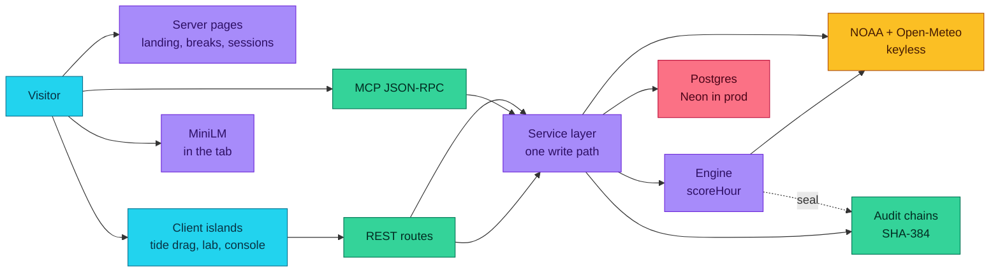

The point of the middle column: **the UI, the REST routes and the MCP tools cannot diverge**, because
none of them talk to the database directly.

### User journey

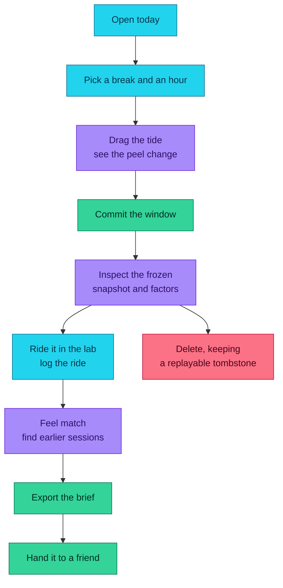

---

## 🌊 Data provenance and the fallback

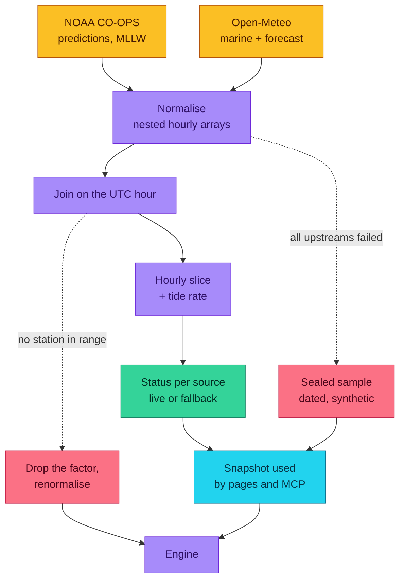

Two keyless public feeds, both attributed on every page that shows their numbers:

| Source | Used for | Access | Licence |
| --- | --- | --- | --- |
| [NOAA CO-OPS](https://tidesandcurrents.noaa.gov/) | Hourly tide predictions, MLLW datum | `product=predictions`, no key | U.S. Government public domain |
| [Open-Meteo Marine](https://open-meteo.com/en/docs/marine-api) | Swell height, period, bearing; wind-wave | No key | CC BY 4.0 |
| [Open-Meteo Forecast](https://open-meteo.com/en/docs) | Wind speed and bearing, air temperature, cloud, rain | No key | CC BY 4.0 |

**The honest parts, which matter more than the features:**

- `product=water_level` is the *observed* product and stops at "now". The app deliberately uses
  `product=predictions` for forecasts, because a surf forecast needs the future.
- Both Open-Meteo endpoints nest their arrays under `hourly`. Reading the wrong level fails **silently** —
  the request succeeds, the arrays are missing, and you serve your offline sample while believing you are
  live. That bug existed in this app; the checked-in verifier caught it. There are now tests against captured
  real response shapes so it cannot come back.
- NOAA's two products do not share a response shape either: the observed one returns `data`, the forecast
  one returns `predictions`. The normaliser accepts both.
- Where a break has **no** NOAA station in range — 6 of the 14 here, including Kovalam and Arugam Bay — the
  tide factor is dropped, the remaining weights are renormalised, and the attribution row says
  "No NOAA CO-OPS station is in range for this break". It never invents a tide, and it never fabricates one
  in the offline sample either.
- When every upstream is unreachable, a **sealed, dated, synthetic** profile is shown and the snapshot is
  labelled `fallback`. It is never presented as today's water, and it never replaces anything you created.
- Break coordinates describe real coastlines. Peel orientation, reef slope and take-off depth are this
  project's own editorial estimates and are labelled as estimates wherever they appear.

---

## 🧮 The engine

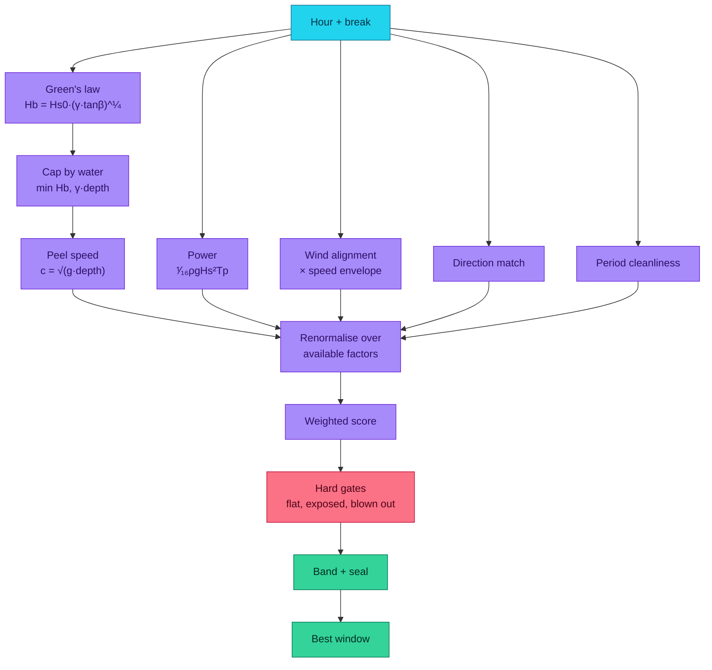

Nominal weights: swell power 0.22, peel speed 0.20, wind quality 0.20, tide window 0.18, direction match
0.12, period cleanliness 0.08 — summing to exactly 1, then renormalised over whatever has real data.
Bands: ≥0.70 get in, ≥0.50 worth the drive, ≥0.30 marginal, else stay home.

Two formulas carry most of the weight, and both are real physics rather than tuning knobs:

- **Green's law on the reef face.** `Hb = Hs0 · (γ·tanβ)^¼` with γ = 0.78, the solitary-wave breaking index.
  Capped by the water you actually have, because a wave in water shallower than `Hb/γ` has already broken
  further out and is closing rather than standing up.
- **Shallow-water celerity.** `c = √(g·depth)`. This is the entire reason tide matters, and the reason the
  signature interaction exists.

Every result is sealed: `seal = SHA-384(genesis ‖ canonicalJson(result body))`, so the verdict you were
shown can be recomputed later. See [`/method`](https://swellread.vercel.app/method) for the full derivation
and every boundary case.

---

## 🔐 Integrity: the seal chain

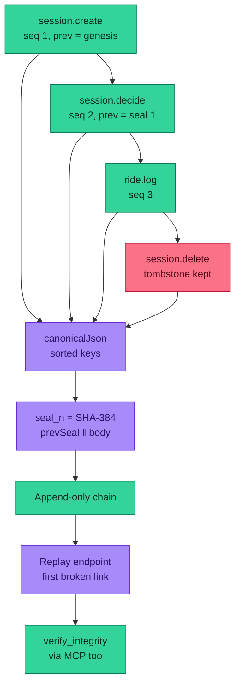

```
seal_n = SHA-384( UTF-8(prevSeal) || canonicalJson(event_n) )
genesis = 96 zeros
```

Canonical JSON sorts object keys recursively by UTF-16 code unit and preserves array order, so the same
event always produces the same bytes whichever client wrote it. `seal` and `prevSeal` are stored *beside*
the body, never inside it, so rewriting a stored seal cannot be laundered by re-hashing.

Every mutation is **one SQL statement** with the entity change and the audit insert gated on the same
`target` CTE, so the row and its seal land together or not at all. Deleting a session is a soft delete that
keeps a tombstone, so the history stays replayable forever.

<p align="center">
  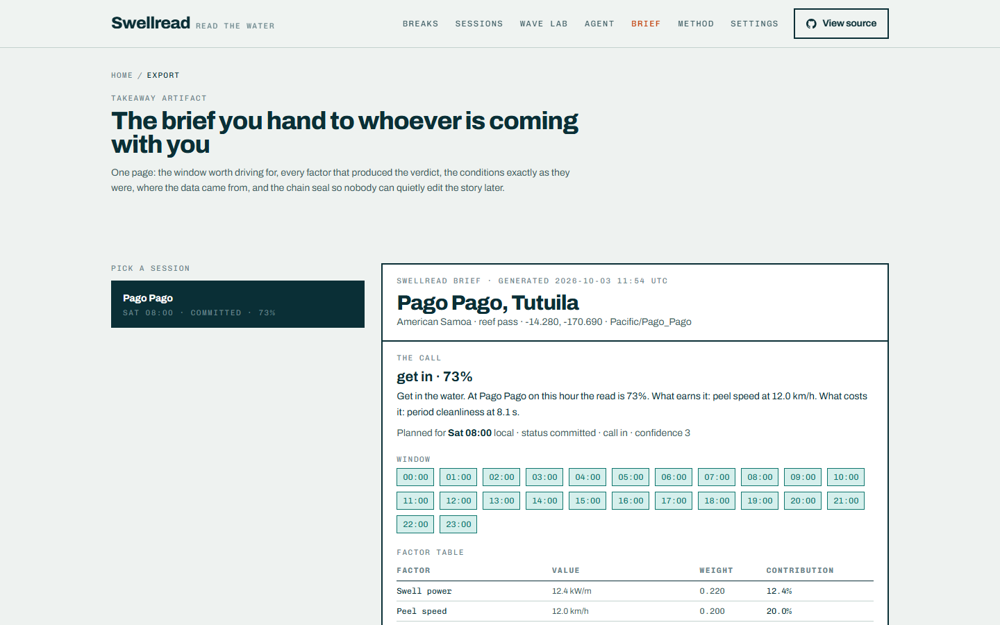
</p>

---

## 🕹 The WebGL wave lab

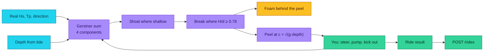

The seabed profile in the shader is the same shape as the cross-section on the break page, so the wave only
breaks where the water is genuinely shallow enough. Keyboard first: **A/D** steer up and down the face,
**W** pumps, **S** stalls, **Space** kicks out. Get ahead of the section and it closes out; fall behind and
you are in the foam.

It is a Gerstner surface, not a CFD simulation, and the riding is a score rather than a physics engine with
a real surfer in it. Take the water model seriously and the gameplay lightly.

---

## 🤖 An agent writing a plan

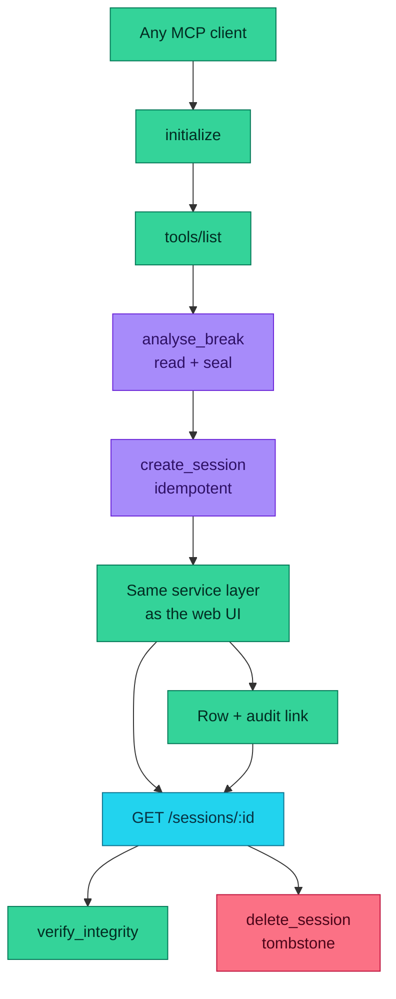

Try it in the [agent console](https://swellread.vercel.app/agent) — one click per tool, with the exact
JSON-RPC request and response on screen, including the error codes.

---

## 🔒 Security model

- **No accounts, no secrets.** The only production environment variable is a database connection string.
  There is no API key anywhere in this application, which is also why the model runs in your browser.
- **Anonymous ownership** is an unguessable id in an HTTP-only, same-site cookie, minted by middleware. Every
  read, update and delete is scoped to it, and there is no code path that returns another rider's row —
  covered by tests, not by inspection.
- **Input** is parsed with a schema before it reaches the service layer. Strings are length-capped, enums
  are closed sets, ids are pattern-checked, and every SQL statement is parameterised. There is no string
  interpolation of user input into a query anywhere in the repository.
- **Errors** are a stable `{ code, message }` envelope. Stack traces, driver messages and environment
  variables are never returned to a client.
- **Abuse controls** are in-memory sliding windows: 20 session creates/min, 40 updates/min, 30 rides/min,
  20 deletes/min, 120 JSON-RPC calls/min per client. **On serverless each isolate keeps its own map, so this
  is a speed bump, not a hard limit** — put a platform WAF or a hosted limiter in front of the write routes
  for a real guarantee. This is stated plainly rather than implied.
- **Upstreams** are exactly two fixed HTTPS hosts, a 9-second timeout and one retry. Payloads are normalised
  and re-validated in TypeScript, and no upstream response is rendered as HTML.

Full detail in [`SECURITY.md`](SECURITY.md).

---

## 🚀 Deployment

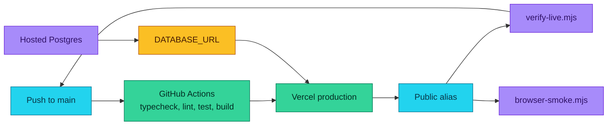

### Verifying a deployment

Two checked-in scripts, both of which use real HTTP and no secrets:

```bash
# 36 assertions: health, live data, CRUD, idempotency, engine, MCP, integrity,
# delete, the repository link in nav and footer, and every primary route.
SWELLREAD_BASE_URL=https://swellread.vercel.app npm run verify

# 14 assertions through real visible controls: the tide drag, committing a
# session, deciding, the brief, the agent console, delete, keyboard focus,
# the WebGL ride loop, mobile, reduced motion — and zero console errors.
SWELLREAD_BASE_URL=https://swellread.vercel.app node scripts/browser-smoke.mjs
```

The browser script needs a Chromium: `npx playwright install chromium`.

---

## 🧭 Roadmap

### Now — shipped

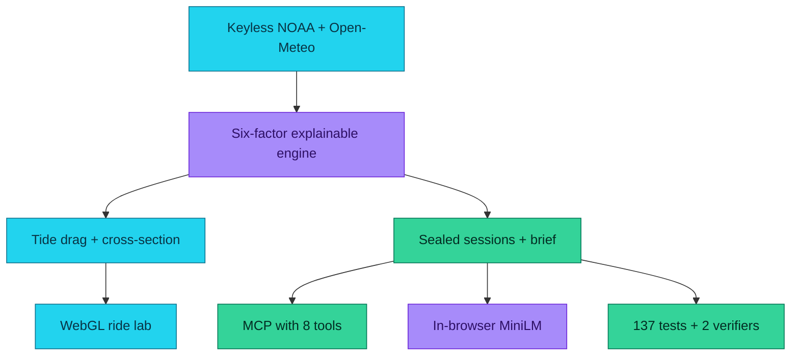

- Live verdicts per break and per hour, with the tide ribbon as the spine of every page.
- The six-factor engine, hard gates, and a SHA-384 seal on every result.
- The tide-drag cross-section and a playable WebGL wave built from the same data.
- Sealed sessions, a printable brief, a share route, and a JSON download.
- Eight MCP tools, four of them mutating, over the same service layer.
- An open-weights embedding model committed to this repository and run in the tab.
- 137 tests, a 36-assertion live verifier, and a 14-assertion browser journey.

### Next — the obvious things

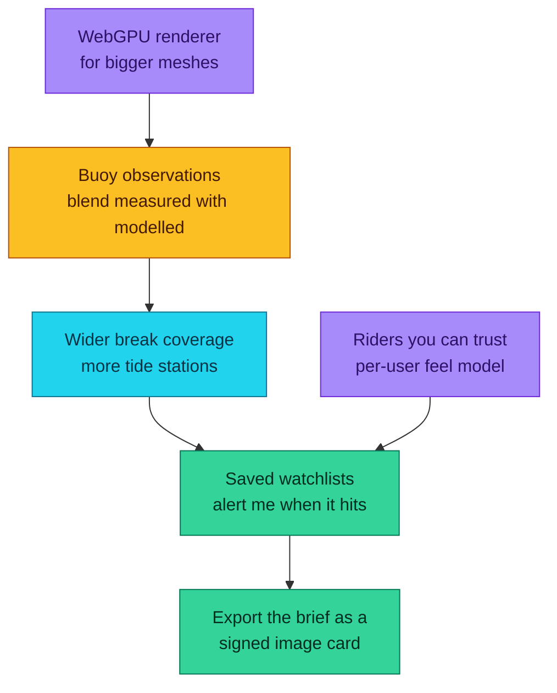

- **More coastlines, more tide stations.** The honest gap right now is NOAA's Pacific coverage, not the
  code. A second keyless tide source would widen it.
- **A feel model per rider.** Once you have twenty sessions with vectors, the "which conditions do you
  actually like" question becomes a ranking rather than a guess.
- **Watchlists that tell you when it hits**, so the decision arrives before the drive, not after it.
- **Buoy observations blended with the model**, so a real measurement can outvote a forecast.
- **A WebGPU renderer**, to push mesh resolution and get the reef into the frame honestly.

### Later — the honest long game

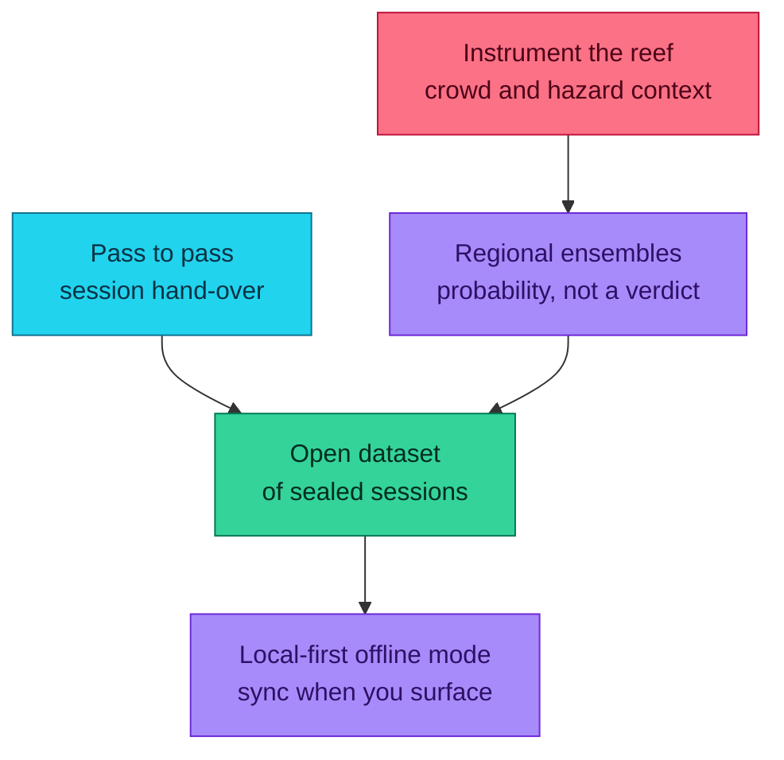

- **Crowd and hazard context** — the part of the decision this app deliberately does not make, and the
  part it most obviously should not make alone.
- **Regional ensembles**: probability of a window rather than a single verdict, because a single number
  about the ocean is always slightly dishonest.
- **Pass to pass**: handing a session to whoever is paddling out next, which is what the seal chain was
  quietly built for.
- **An open dataset of sealed sessions**, so the feel model can be learned outside this app.
- **Local-first offline mode**, because a forecast tool that needs a network is a forecast tool that fails
  in exactly the places the forecast matters.

---

## ⚠️ Safety

Swellread describes **the surface of the ocean**. It does not know what is happening underneath it, and it
cannot see your ability, your fitness, the state of the reef, the current, or a rips. It is a planning aid
for deciding *when*, never a safety guarantee, and the app says so on every page that shows a verdict. The
`reef-exposed` gate exists because running out of water over a reef is a hazard rather than a low score.

## 📄 Attribution

Wave and wind data from [Open-Meteo](https://open-meteo.com/) (CC BY 4.0). Tide predictions from
[NOAA CO-OPS](https://tidesandcurrents.noaa.gov/) (U.S. Government public domain). Sentence-embedding
weights are [all-MiniLM-L6-v2](https://huggingface.co/sentence-transformers/all-MiniLM-L6-v2) (Apache-2.0),
committed under `public/models/`. Built with [Next.js](https://nextjs.org),
[three.js](https://threejs.org), [PGlite](https://pglite.dev),
[transformers.js](https://github.com/huggingface/transformers.js) and
[Vercel](https://vercel.com).

## 🤝 Contributing

Please read [CONTRIBUTING.md](CONTRIBUTING.md) — the short version is that a factor change needs the
physics and the tests, a data source needs attribution and a bounded timeout, and a new break only gets a
tide station if NOAA genuinely publishes one.

Issues and pull requests are welcome:
[github.com/aniruddhaadak80/swellread](https://github.com/aniruddhaadak80/swellread/issues)

## 📄 Licence

MIT — see [LICENSE](LICENSE).
